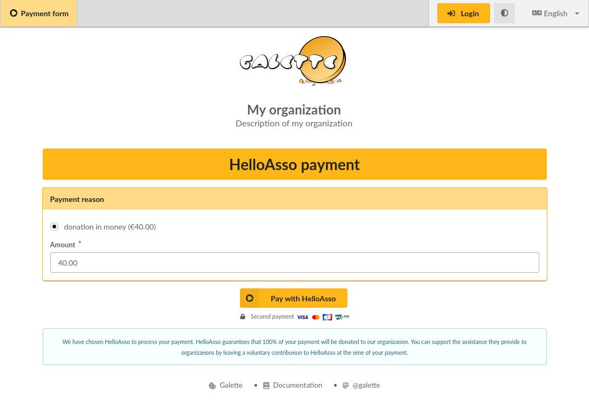
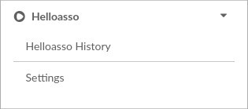
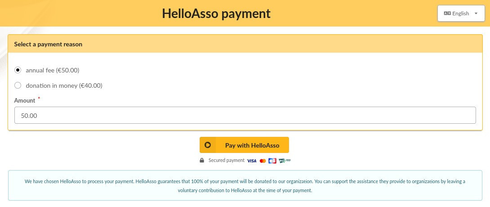
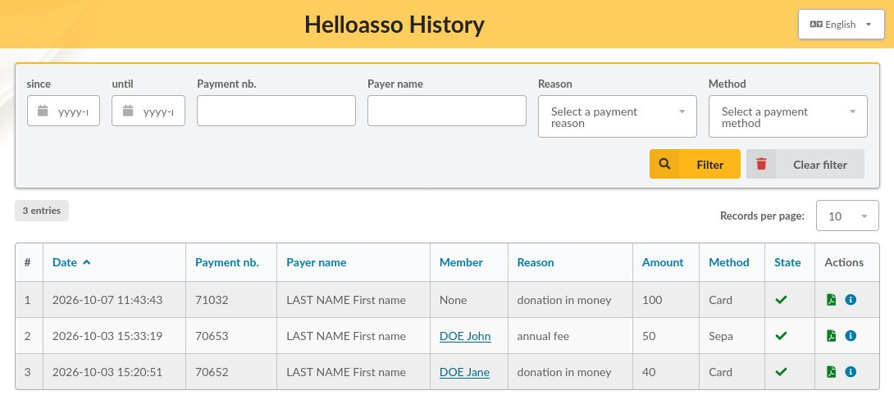
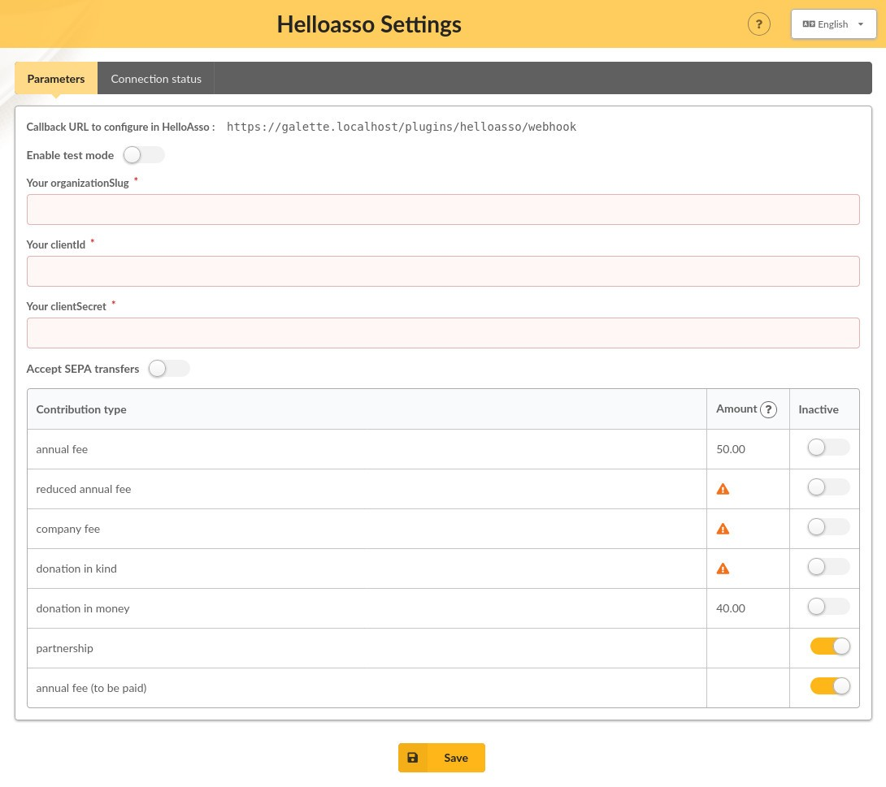
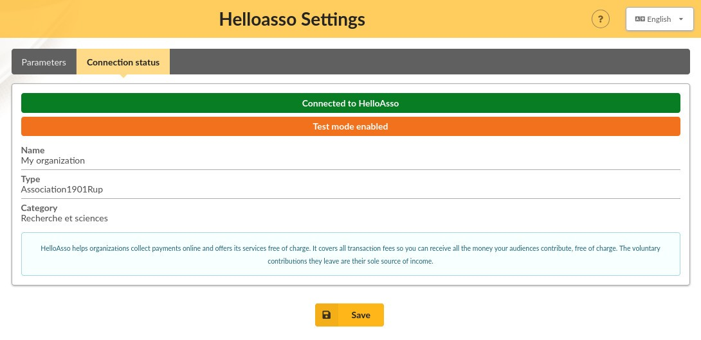

> **Note** — HelloAsso primarily serves **French** associations and non-profit organizations.

This plugin provides:

* a payment form,
* a payment history,
* automatic creation of contributions in Galette once payments are validated.



> **Note** — This plugin requires your Galette instance to be publicly reachable and served with a valid SSL certificate.

## Installation

First of all, download the plugin:

* [Get latest HelloAsso plugin!](https://github.com/galette-plugins/plugin-helloasso/releases/latest)
* [Get HelloAsso plugin nightly build!](https://github.com/galette-plugins/plugin-helloasso/releases/tag/nightly)

Extract the downloaded archive into Galette `plugins` directory. For example, on Linux (replacing *{url}* and *{version}* with the corresponding values):

```
$ cd /var/www/html/galette/plugins
$ wget {url}
$ tar xjvf galette-plugin-helloasso-{version}.tar.bz2
```

## Database initialization

In order to work, this plugin requires several tables in the database. See the [Galette plugins management interface](https://doc.galette.eu/en/master/plugins/index.html#plugins-managment).

And that's it; the *HelloAsso* plugin is installed. :)

## Plugin usage

Once the plugin is installed, a *Helloasso* group is added to the Galette menu when a user is logged-in, allowing administrators and staff members to define the settings of the plugin and view the payments history.



The payment form is available from Galette's public pages.

Only *logged-in* users can pay contributions *with membership extension* (or membership fees).



Visitors (users *not logged* into their account) can only pay contributions *without membership extension* (or donations). In this case, no contribution is automatically created in Galette, the payment only appears in the plugin's payment history with the value "None" in the "Member" column.



## Preferences



### Settings

* **Callback URL to set in HelloAsso**: enter this URL in the *"Mon URL de callback"* field, in the "Intégrations et API" section of your association's HelloAsso account.
* **Enable test mode**: to use the test mode, first create a test account on [helloasso-sandbox.com](https://www.helloasso-sandbox.com). You can then check how the plugin works without making real online payments.

  > **Warning** — In this mode, never use real credit card numbers, but only test cards (see the list of test cards from the [Stripe documentation](https://docs.stripe.com/testing#cards) or from the [Worldline documentation](https://docs.sips.worldline-solutions.com/fr/cartes-de-test.html)).

* **Your organizationSlug**: you will find it in your browser's address bar while logged in to your association's HelloAsso account. It is the first part of your account URL path. For example, in the URL `https://admin.helloasso.com/{organizationSlug}/accueil` it is *{organizationSlug}*.
* **Your clientId**: you will find it in the *"Mon clientID"* field, in the "Intégrations et API" section of your association's HelloAsso account.
* **Your clientSecret**: you will find it in the *"Mon clientSecret"* field, in the "Intégrations et API" section of your association's HelloAsso account.


* **Accept SEPA transfers** : by default, only payments with a credit card are proposed on HelloAsso's payment form. Enable this option if you also want to propose on the form SEPA transfers payments.
* **Contribution types**: in this table, you can disable the [contribution types configured in Galette](https://doc.galette.eu/en/master/usermanual/contributions.html#contributions-types) that you do not want to be proposed as a payment reason on the payment form.

  *Contribution types with a zero amount, or whose amount is not configured, will not be offered as payment reasons on the form, even if they are not marked as inactive in the table.*

  > **Note** — A description, displayed below each payment reason proposed on the payment form, can be defined from the [configuration of the contributions types](https://doc.galette.eu/en/master/usermanual/contributions.html#contributions-types) of Galette.

> **Note** — It is possible to decide who can access the payment form in Galette's settings. Choose the desired option in the [public pages visibility parameters](https://doc.galette.eu/en/master/usermanual/preferences.html#parameters).

### Connection status

This screen shows whether the plugin is correctly set up and connected to HelloAsso.


